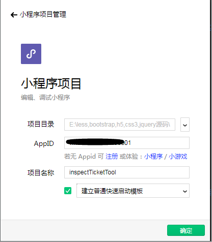

# 小程序

## 小程序简介
> 微信小程序是一种全新的连接用户与服务的方式，它可以在微信内被便捷地获取和传播，同时具有出色的使用体验。

## 个人对小程序与web开发的看法
>小程序的开发我个人认为是view+wxcc实现的静态页面的布局，可类比于web开发的div+css实现的静态页面的布局（当然，为了让浏览器更能语义化的解析页面，常常在web开发上不单单使用div，还有其他更多的h1，span，p等标签）。
而在逻辑的交互上，小程序其实有点类似于web开发引用了vue框架进行数据渲染和事件触发。
[关于小程序逻辑开发](https://developers.weixin.qq.com/miniprogram/dev/quickstart/basic/file.html#WXML-%E6%A8%A1%E6%9D%BF)

## 小程序官方文档

### 小程序接入指南(官方文档说明)
[小程序接入](https://developers.weixin.qq.com/miniprogram/introduction/index.html?t=201868)

### 小程序开发工具使用指南（官方文档说明）
[微信开发者工具](https://developers.weixin.qq.com/miniprogram/dev/devtools/devtools.html)

### 小程序开发（官方文档说明）
[小程序开发](https://developers.weixin.qq.com/miniprogram/dev/index.html?t=2018410)

### 小程序发布（官方文档说明）
[小程序发布准备及上线](https://developers.weixin.qq.com/miniprogram/dev/quickstart/basic/role.html)

### 小程序社区（官方社区）
[官方社区](https://developers.weixin.qq.com/)

## 小程序实战（以个人小程序为例，企业级开发可直接跳转到开发工具下载开始看起）

### 小程序注册
> 1. 先进行小程序注册：[https://mp.weixin.qq.com/wxopen/waregister?action=step1](https://mp.weixin.qq.com/wxopen/waregister?action=step1)

> 2. 然后完成邮箱激活后选择账号主体类型，并完成主体信息登记。（我的个人）,完成后即可跳转到小程序信息完善流程。

### 小程序信息完善
> 完成了小程序的注册就进行相关的小程序信息的完善了。

### 开发工具下载
> 最后就可以进行相关的小程序开发了：微信开发者工具下载：[https://developers.weixin.qq.com/miniprogram/dev/devtools/download.html](https://developers.weixin.qq.com/miniprogram/dev/devtools/download.html)

### 小程序开发流程

#### 选择开发模式：小程序项目
> 开发模式分类:
> 1. 公众号网页调试。选择公众号网页调试，将直接进入公众号网页项目调试界面，在地址栏输入 URL，即可调试该网页的微信授权以及微信 JS-SDK 功能。
> 2. 小程序调试。选择小程序调试，将进入小程序本地项目管理页，可以新建、删除本地的项目，或者选择进入已存在的本地项目。

#### 新建项目
> 本地初始化小程序项目，若无AppID，则在体验模式下部分API可能无法正常调用。
> 查下AppID(小程序ID)在设置-> 开发设置中查看

> 项目的主界面及项目的说明(更详细的说明可以查看我上面说的[官方文档说明](https://developers.weixin.qq.com/miniprogram/dev/devtools/devtools.html))

> 在小程序后台配置服务器域名(详细的[API说明](https://developers.weixin.qq.com/miniprogram/dev/api/api-network.html))

> 则可在开发者工具中看到相关的域名配置

#### 新建页面
> 通过pages直接新建目录，然后在创建的目录下直接新建page即可完成js、json、wxml和wxss文件的创建，并且工具会自动的将我们创建的页面添加到[app.json](https://developers.weixin.qq.com/miniprogram/dev/quickstart/basic/file.html#JSON-%E9%85%8D%E7%BD%AE)下面，接下来我们就可以进行正式的业务逻辑的开发了。

## 常用功能总结

### 页面跳转
>1. [wx.navigateTo(OBJECT)](https://developers.weixin.qq.com/miniprogram/dev/api/ui-navigate.html#wxnavigatetoobject)：保留当前页面，跳转到应用内的某个页面，使用wx.navigateBack可以返回到原页面。

>2. [wx.redirectTo(OBJECT)](https://developers.weixin.qq.com/miniprogram/dev/api/ui-navigate.html#wxredirecttoobject)：关闭当前页面，跳转到应用内的某个非tabBar页面。

>3. [wx.switchTab(OBJECT)](https://developers.weixin.qq.com/miniprogram/dev/api/ui-navigate.html#wxrelaunchobject)：跳转到 tabBar 页面，并关闭其他所有非 tabBar 页面。

>4. [<navigator url=''>跳转</navigator>](https://developers.weixin.qq.com/miniprogram/dev/component/navigator.html)：页面链接

>5. [wx.reLaunch(OBJECT)](https://developers.weixin.qq.com/miniprogram/dev/api/ui-navigate.html#wxrelaunchobject)：可以打开任意页面

### tabBar(导航栏)设置
> 一般通过app.json文件进行相关tab的设置。

### 下拉刷新/上拉加载(分页)
> 下拉刷新/上拉加载需要通过监听页面的生命周期进行相关方法的添加，并设置当前page的json文件enablePullDownRefresh设置为true(默认情况下false)

### 更多

#### [数据渲染](https://developers.weixin.qq.com/miniprogram/dev/framework/view/wxml/)

#### [交互弹层](https://developers.weixin.qq.com/miniprogram/dev/api/api-react.html#wxhideloading)

#### [代码结构及说明](https://developers.weixin.qq.com/miniprogram/dev/quickstart/basic/file.html)
